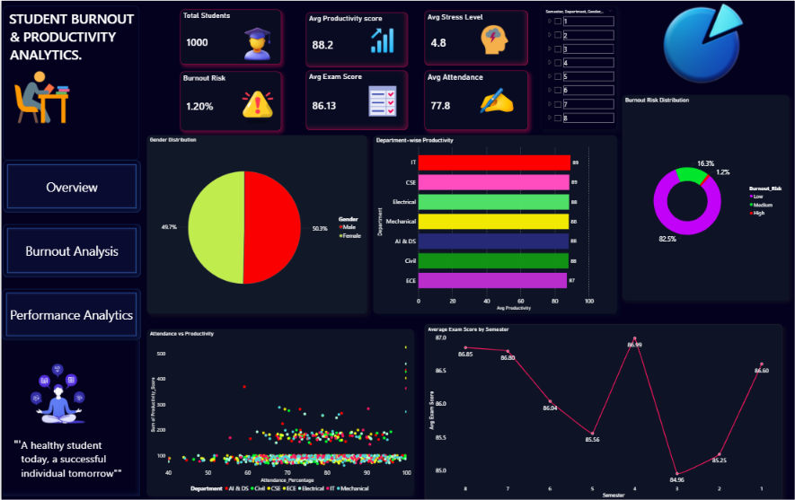
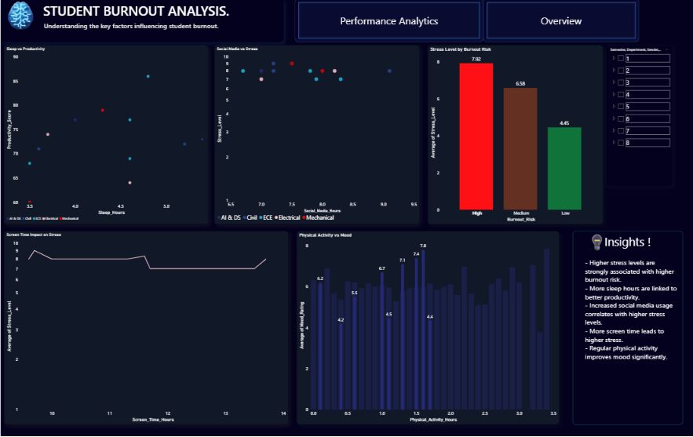
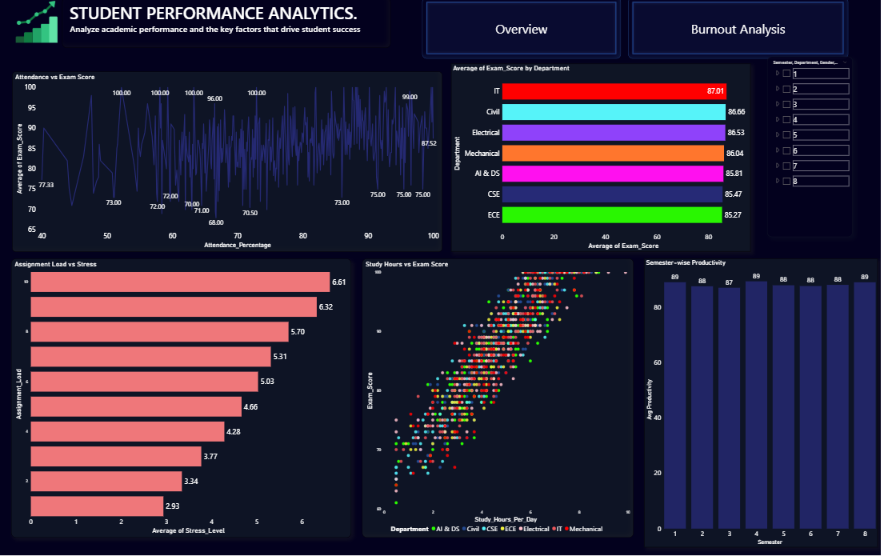

# 📊 Student Burnout & Productivity Analytics

## 📌 Project Overview
This is a Power BI dashboard project focused on analyzing student burnout, stress, productivity, and academic performance.

The dashboard helps identify behavioral and academic patterns using interactive visualizations and KPI tracking.

---

# 🛠 Tools Used
- Power BI
- Power Query
- DAX
- Excel
- Data Visualization

---

# 📂 Dashboard Pages

## 1️⃣ Overview Dashboard
Includes:
- KPI Cards
- Burnout Risk Distribution
- Department-wise Productivity
- Attendance vs Productivity
- Exam Score Trends

---

## 2️⃣ Burnout Analysis
Includes:
- Stress vs Burnout
- Sleep vs Productivity
- Social Media vs Stress
- Screen Time Impact on Stress
- Physical Activity vs Mood

---

## 3️⃣ Performance Analytics
Includes:
- Study Hours vs Exam Score
- Attendance vs Exam Score
- Assignment Load vs Stress
- Department-wise Exam Performance
- Semester-wise Productivity

---

# 📷 Dashboard Preview

## Overview Dashboard

## Burnout Analysis

## Performance Analytics

---

# 🚀 Key Insights
- High stress levels are associated with increased burnout risk.
- Better attendance improves productivity and exam performance.
- Sleep hours positively impact productivity.
- Social media usage contributes to stress patterns.

---

# 👨‍💻 Author
Vaibhav Rajendra Waghole
